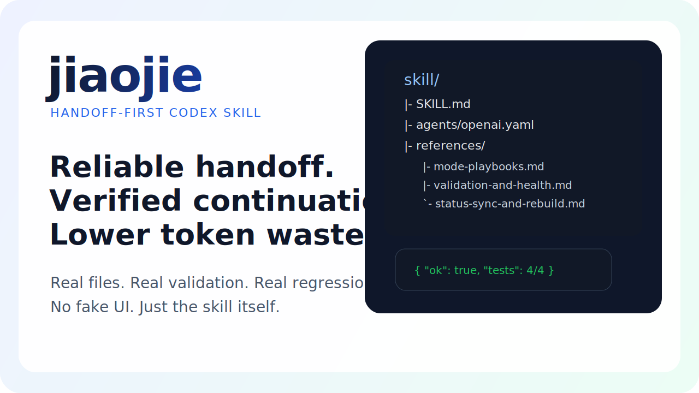

# <div align="center">jiaojie</div>

<p align="center">
  <strong>A handoff-first Codex skill for reliable resume, rebuild, and document health validation.</strong>
</p>

<p align="center">
  
  
  
  
</p>



## Why this exists

Most thread-to-thread continuation breaks in one of four ways:

1. the next thread re-explores the whole repository,
2. stale conclusions survive after the code or docs changed,
3. handoff notes become bloated and unusable,
4. Windows plus PowerShell plus Chinese text creates false "corruption" alarms.

`jiaojie` exists to stop that drift.

It turns handoff into a repeatable workflow:

- read the handoff bundle first,
- expand only when needed,
- validate before trusting a status claim,
- keep main docs and handoff docs in sync,
- reduce token waste in long-running projects.

## What it delivers

- A compact skill workflow for `收尾交接`, `继续交接`, and `重建交接`
- Reference guides for mode routing, validation, sync, and Windows-safe writing
- Script-backed checks for handoff structure, stale status, and encoding diagnosis
- A read-only regression suite to keep the skill honest over time

## Quick start

### Option A: install from source

```bash
git clone https://github.com/LCbeijing/jiaojie
cp -R jiaojie/skill "${CODEX_HOME:-$HOME/.codex}/skills/jiaojie"
```

### Option B: one-line install

```bash
curl -fsSL https://raw.githubusercontent.com/LCbeijing/jiaojie/main/install.sh | bash
```

### Verify the install

```bash
python3 "${CODEX_HOME:-$HOME/.codex}/skills/jiaojie/scripts/regression_readonly.py" --json
```

Expected result:

- `"ok": true`
- all tests passed

## Download and release packaging

`jiaojie` is a skill repository, so the packaging flow stays intentionally simple.

Build a distributable zip locally with:

```bash
python3 scripts/build_release_package.py
```

If you want a versioned package when publishing:

```bash
python3 scripts/build_release_package.py --version v0.1.0
```

This generates:

- `dist/jiaojie-skill.zip`
- `dist/jiaojie-skill.zip.sha256`

Or, when `--version` is provided:

- `dist/jiaojie-skill-v0.1.0.zip`
- `dist/jiaojie-skill-v0.1.0.zip.sha256`

## Typical use cases

- End-of-thread handoff when a work batch is about to stop
- Resume from an existing handoff bundle without asking the user to re-explain context
- Rebuild a stale, contradictory, or missing handoff bundle
- Verify whether a "broken" document is actually corrupted or only displayed incorrectly
- Keep `handoff.md` aligned with the current state of the main project docs

## Architecture

### Workflow


## Comparison

| Approach | Continuation speed | Drift resistance | Validation | Windows/Chinese safety | Long-term maintainability |
| --- | --- | --- | --- | --- | --- |
| Ad-hoc handoff notes | Low | Low | Manual | Weak | Low |
| Generic prompt-only continuation | Medium | Low | Usually none | Weak | Medium |
| `jiaojie` | High | High | Script-backed | Strong | High |

## Repository layout

```text
jiaojie/
├── README.md
├── CONTRIBUTING.md
├── LICENSE
├── SECURITY.md
├── CODE_OF_CONDUCT.md
├── install.sh
├── skill/
│   ├── SKILL.md
│   ├── agents/openai.yaml
│   ├── references/
│   └── scripts/
├── scripts/
│   └── build_release_package.py
└── docs/images/cover.svg
```

## Example triggers

Typical user phrases that should trigger this skill:

- `收尾交接`
- `继续交接`
- `重建交接`
- `交接包`
- `jiaojie`
- `$jiaojie`

## FAQ

### Is this only for Chinese-language projects?

No. The workflow is general, but the current prompts and examples are optimized for Chinese development handoff patterns.

### Does it replace project documentation?

No. It reduces continuation cost by structuring the handoff layer around the existing project docs.

### Why not just write a longer prompt?

Because repeated continuation fails when the status is stale, unverified, or too bloated to trust. `jiaojie` solves that with routing plus validation.

### Is there a packaged release?

Source install works today. A reproducible release package can be built locally with:

```bash
python3 scripts/build_release_package.py
```

## Roadmap

- Add a packaged GitHub Release artifact for direct download
- Add more regression fixtures for alias-heavy repositories
- Expand multilingual docs beyond Chinese-first workflows
- Add stronger repo-level examples for real-world handoff bundles

## Contributing

Contributions are welcome, especially if they improve:

- validation accuracy,
- install reliability,
- multilingual clarity,
- or regression coverage.

See [CONTRIBUTING.md](./CONTRIBUTING.md).

## License

MIT. See [LICENSE](./LICENSE).
